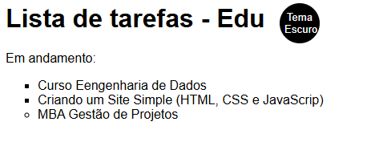
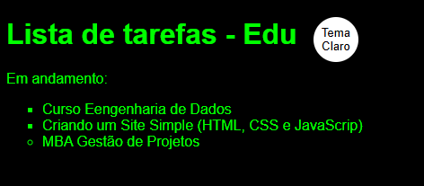
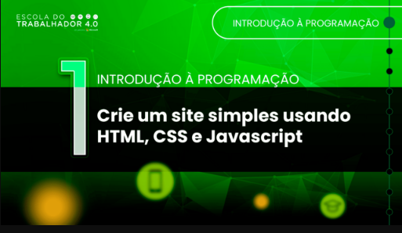

# 🌗 Lista de Tarefas - Tema Claro/Escuro

Este é um projeto simples em **HTML, CSS e JavaScript** que demonstra:

- Estrutura básica de um site com lista de tarefas
- Uso de variáveis CSS (`:root`) para alternar temas
- Botão que alterna entre **tema claro** e **tema escuro**
- Boas práticas de documentação em código

## 📂 Estrutura do Projeto
├── index.html # Página principal
├── main.css # Estilos (temas claro e escuro)
└── app.js # Lógica de alternância de tema

## 🚀 Como usar

1. Clone este repositório:
   ```bash
   git clone https://github.com/seu-usuario/nome-do-repo.git

2. Acesse a pasta do projeto: "sitesimples"
3. Abra o arquivo index.html no seu navegador.

🎨 Funcionalidades
Lista de tarefas com alguns exemplos já preenchidos.
Botão no canto superior que alterna entre:
🌞 Tema Claro
🌑 Tema Escuro

🛠️ Tecnologias utilizadas
HTML5
CSS3 (variáveis, custom properties)
JavaScript (DOM e eventos)

📸 Demonstração

* Tema_Claro:


*Tema_Escuro:


📌 Observações
Este projeto foi criado com fins educacionais (prática de HTML, CSS, JS e documentação) proporicionado pela escola do trabalhador (https://ead.escoladotrabalhador40.com.br/#/) na seção cursos: 21. Introdução à Programação.
 

Para testar em outros dispositivos, basta abrir o index.html em qualquer navegador moderno.

👤 Autor
Eduardo C. Reis
🔗 GitHub
🔗 LinkedIn